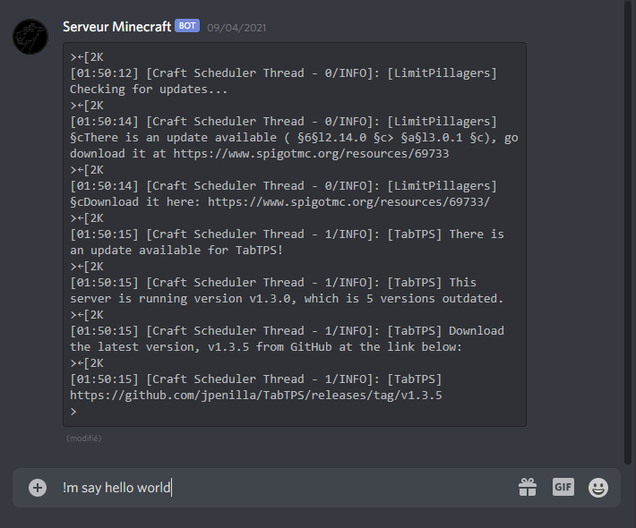
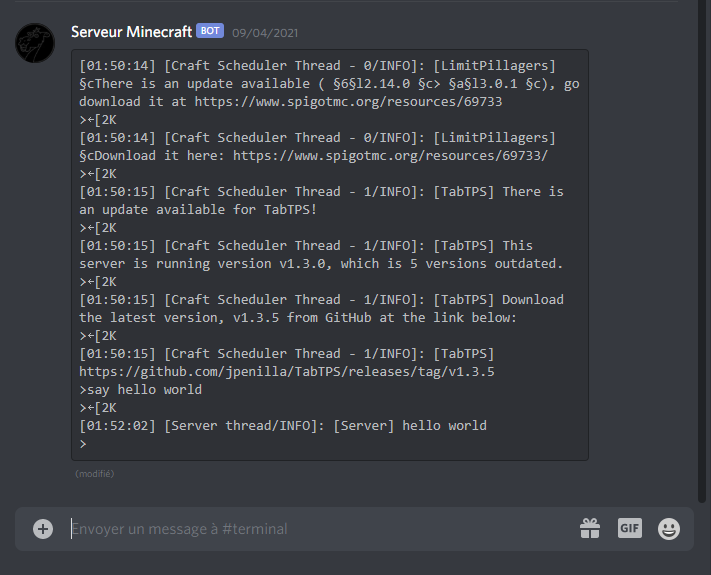
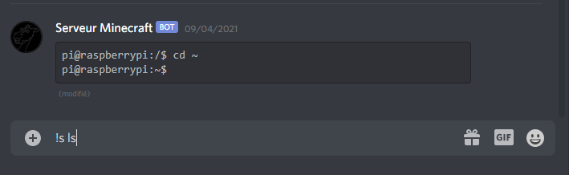
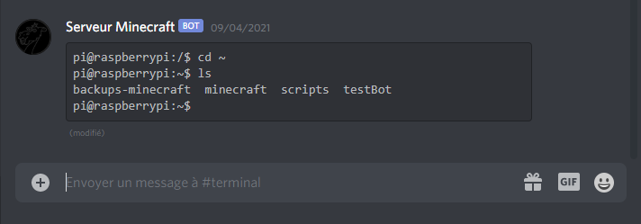
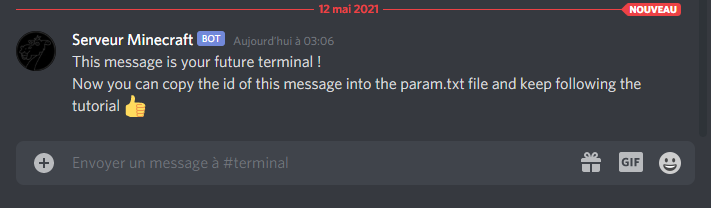

# McDiscordTerminal
A way to interact with your minecraft server terminal from discord

### How do i use it ?

Once installed simply go to your terminal discord channel and type your commands directly in the chat like this :

#### there is 4 commands :  
``!m [your minecraft command]``\
``!s [your shell command]``\
``!tm`` *display the minecraft terminal*\
``!ts`` *display the shell terminal*

 \
 

### How do i set it up ?

#### 1) Requirements
You must have : 
1. [python](https://www.python.org/), [screen](https://linuxize.com/post/how-to-use-linux-screen/) and [Watchdog](https://github.com/gorakhargosh/watchdog) installed on your server.
2. a discord bot account, if you dont have one yet go to the [discord developper portal](https://discord.com/developers/docs/intro) and [create one](https://discordpy.readthedocs.io/en/stable/discord.html).

#### 2) Download

Theoretically you can download [McDiscordTerminal](https://github.com/TrOllOchamO/McDiscordTerminal) in any directory on your server and it should work fine, though i only tested it when the file resided directly in my linux user which hosts the server.

#### 3) Initialize

To display the terminal in your discord channel, [McDiscordTerminal](https://github.com/TrOllOchamO/McDiscordTerminal) simply edits an existing message. This means that in order to start displaying stuff, you'll need the bot to send a message first so it can edit it later.\

In order to do that, you first need to edit the ``param.txt`` text file, add the token of your bot and the channel id in which you want your minecraft terminal. You can check the [param-example.txt](./param-example.txt).\
Don't forget to [invite your bot](https://discordpy.readthedocs.io/en/stable/discord.html#inviting-your-bot) on your server.

Run ``initialize-terminal.py``. If you followed the steps before, your bot should send a message in your future terminal channel.

\
Simply copy the id of his message and finish to edit the ``param.txt`` file. You still can check the [param-example.txt](./param-example.txt).

You are done initializing !

#### 4) Use

The only thing left to use your bot is to run your minecraft server using the ``run-server.py`` script and after that run ``McDiscordTerminal.py``.
